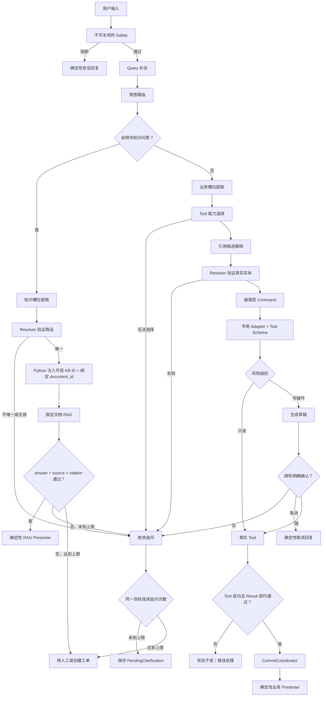

# 智能客服正式链路开发设计（Review 稿）

## 1. 目标与范围

本次调整的目标不是重写客服，而是把现有能力重新编排为一条职责清晰、可验证、
失败不污染状态的正式链路。

本阶段覆盖：

- 商品目录、推荐、对比与商品详情；
- 商品说明书知识问答；
- 订单列表、订单详情与物流；
- 售后草稿、确认与取消；
- 转人工；
- Query 补全、意图路由、槽位提取、Tool 选择和引用理解的独立开关；
- 澄清收敛和连续失败后的升级。

本阶段不包含：

- 数据库 Schema 或数据迁移；
- `.env` 修改；
- 新的生产部署配置；
- 删除历史兼容代码；
- 非说明书类知识问答。

## 2. 不可破坏的不变量

1. `metadata["customer_service"]["state"]` 是唯一跨轮可信业务状态。
2. 原始消息属于有界对话记忆，不是可信业务事实。
3. LLM 可以补全表达、识别意图、提出槽位候选和能力候选，但不能提交可信状态。
4. LLM 对“第一个、它、那个订单”的解释只是引用候选；真实实体必须由 Resolver
   在当前有效候选批次中验证。
5. LLM 选择的 Tool 和参数只是候选，必须重新经过强类型 Command、专用 Adapter 和
   真实 Tool `args_schema.model_validate()`。
6. 商品、订单、说明书绑定、库存、价格和物流等事实只能来自真实只读 Tool。
7. Tool 成功且 Result 契约通过后才允许 Commit。
8. 写操作保留 `draft -> operation_id/draft_id -> 明确确认 -> confirm` 和幂等门禁。
9. 结构化结果由确定性 Presenter 输出；Final LLM 为 0。
10. 说明书回答必须通过 `answer + source + citation` 证据门禁。
11. 单轮最多两个业务 Tool；`CONTINUE` 不得再次执行理解链。
12. Safety、权限、实体验证、Schema、Result 契约、Commit 和证据门禁不可被配置关闭。

## 3. 正式处理流程



## 4. 五个独立开关

禁止增加总开关。每个阶段独立选择策略：

| 配置项 | 控制范围 | `rule_only` | `hybrid` | `llm_only` |
|---|---|---|---|---|
| `CUSTOMER_SERVICE_QUERY_REWRITE_MODE` | 是否补全省略句 | 只用规则补全 | 规则无法完整补全时调用轻量 LLM | 每个普通回合调用轻量 LLM |
| `CUSTOMER_SERVICE_INTENT_ROUTING_MODE` | 知识/业务及业务意图路由 | 只用规则 | 规则无结果或冲突时调用重量 LLM | 重量 LLM 产生意图候选 |
| `CUSTOMER_SERVICE_SLOT_EXTRACTION_MODE` | 提取用户表达的槽位 | 只用规则 | 缺关键槽位时调用重量 LLM | 重量 LLM 产生槽位候选 |
| `CUSTOMER_SERVICE_TOOL_SELECTION_MODE` | 推荐一个可用能力 | Python 映射 | FSM 无分支时调用重量 LLM | 重量 LLM 选择能力候选 |
| `CUSTOMER_SERVICE_REFERENCE_INTERPRETATION_MODE` | 理解序数、代词和省略引用 | 只用规则 | 规则不明确时调用重量 LLM | 重量 LLM 产生引用表达候选 |

已实现：5个开关全部使用 `llm_only`。五项是独立的逻辑来源和调试记录，不是五次模型
调用；普通回合由一次轻量 Query 补全调用，加一次共享的重量 Function 调用完成意图、
槽位、引用表达和能力候选。

### 4.1 引用开关的准确边界

`REFERENCE_INTERPRETATION` 不能替代 Resolver：

```text
LLM 输出：ordinal=1、reference_text="第二个"、domain=product
Resolver 输出：当前有效批次 position=1 对应的可信 product_code
```

LLM 不允许仅根据历史文本直接声明某个 `product_code` 或 `order_ref` 已被验证。

## 5. 两类 LLM 的职责

### 5.1 轻量 LLM：Query 补全

- 模型配置：`qwen3.7-flash-2026-07-15` 对应的现有配置入口；
- 输入：当前原话、最近完整对话轮次、受控结构化摘要；
- 唯一输出：`rewritten_query: str`；
- 禁止输出：intent、slots、Tool、真实实体、数据库事实；
- 输出必须进入后续意图路由，不得直接调用 Tool。

### 5.2 重量 LLM：语义候选和原生 Function Tool 候选

- 模型配置：项目通用 `qwen-turbo` 对应的现有配置入口；
- 输入：补全后的 Query、受控对话、可信状态摘要、可用能力的 JSON Schema；
- 可输出：意图候选、槽位候选、引用表达候选、一个能力调用候选；
- 禁止输出：可信实体结论、保护参数、数据库事实、最终回答；
- Tool 参数必须经过 Pydantic、Resolver、Command、Adapter 和真实 Tool Schema 再校验。

## 6. 知识分支与业务分支的职责

### 6.1 知识分支仅限说明书

以下问题进入说明书 RAG：连接、蓝牙、充电、兼容、按键、使用方法、保修说明等
需要从商品绑定资料核验的内容。

处理顺序：

1. 识别完整说明书问题；
2. Resolver 确定可信商品；
3. 商品 Tool 验证商品并取得绑定的 `primary_manual_document_id`；
4. Python 从运行时可信范围取得允许的 `knowledge_base_id`；
5. 仅以该 `knowledge_base_id + document_id` 调用 `knowledge_search`；
6. Evidence Gate 验证回答、来源和引用；
7. Presenter 原样组织有证据的回答，不做 LLM 润色。

没有绑定文档、知识库越权、RAG 无证据时不得回答业务断言。

### 6.2 业务分支

商品目录、推荐、对比、订单、物流、售后和转人工进入业务分支。

- LLM 选择的是“能力候选”，不是直接执行权；
- Python 生成强类型 Command；
- Adapter 是最终 Tool 参数的唯一入口；
- 只读操作验证通过后直接执行；
- 写操作必须先生成草稿并等待明确确认。

## 7. 澄清与升级策略

1. 0 候选且可安全查询：先调用只读 Tool，不立即追问。
2. 1 个可信候选：自动解析。
3. 多候选且无法唯一缩小：追问。
4. 同一澄清目标最多连续两轮。
5. 用户切换意图：暂停或清除旧澄清，不把肯定词错误应用到旧目标。
6. 用户回复“是、需要、对、查吧”时，如果存在有效 `PendingClarification`，恢复其中的
   `resume_action`；本地规则无法解释时，可由 Query 补全 LLM 补成完整请求。
7. 两轮后仍无法可靠处理：转人工。当前系统只有售后工单 Tool，没有通用咨询工单
   Tool；如果要求同时创建通用工单，需要另立能力范围，不能复用售后 Tool 冒充。
8. 售后草稿被商品、订单查询等其他意图打断时保留，但普通“确认、好的、可以”不得
   在打断后直接提交；恢复时必须明确确认当前售后草稿。

## 8. 正式实现状态

### 8.1 正式核心模块

- `contracts.py` 的 Execution、Command 和商品候选基础契约；
- `entity_resolver.py` 的可信候选解析原则；
- `command_builder.py` 的强类型 Command 构建；
- `adapters.py` 的唯一参数入口；
- `commit.py` 的 Result 校验和成功后提交；
- `presenter.py` 的确定性输出和 RAG 门禁；
- `hooks.py` 的 Tool 前后置校验；
- `strategy.py` 的阶段控制和单轮两 Tool 上限；
- 售后 draft/confirm 与幂等门禁。

### 8.2 已完成的职责拆分

- `understanding.py`：拆开 Query 补全、意图路由、槽位提取和引用解释；
- `capability_selector.py`：受控能力选择器，支持只读能力、售后 draft 和转人工候选；
- `strategy.py`：显式区分知识分支、业务分支、澄清分支和升级分支；
- `contracts.py`：提供强类型 `OrderContext`、`DialogFocus`、`PendingClarification`；
- 调试详情：按五个阶段分别记录是否触发、输入摘要、输出、校验结果和失败原因。

### 8.3 已完成的历史清理

- 已移除不参与正式链路的单文件 Planner；
- 已移除 `hooks.py` 的历史动态导入回退；
- 已迁移仍有价值的并发和 CAS 测试，并移除只绑定旧路径的测试与 Schema；
- 正式实现不再保留平行 Planner、通用 DST 或旧语义改写模块。

## 9. 已完成的实施阶段

1. 状态契约和迁移兼容；
2. 五个独立开关；
3. Query、语义候选、能力选择和可信解析分层；
4. 知识/业务分流、风险门禁、澄清和失败升级；
5. 历史清理、场景回归、Pyright 和全量测试。

## 10. 已确认决策

1. 候选批次不采用固定轮次 TTL；没有查询新批次且原候选消息仍在记忆窗口时继续有效；
2. 原候选回复被记忆裁剪后，对应序数立即失效；
3. 售后草稿被其他意图打断后保留，恢复时重新执行明确确认门禁；
4. “能否打游戏”等用途能力问题统一进入商品说明书证据链；
5. 五个独立开关全部使用 `llm_only`。

## 11. 后续仍需单独确认的实施项

1. 连续两轮无法澄清后是否仅转人工；如果要求创建通用咨询工单，需要另行设计 Tool；
2. 高风险范围当前只包括售后确认，转人工本身按低风险执行。
